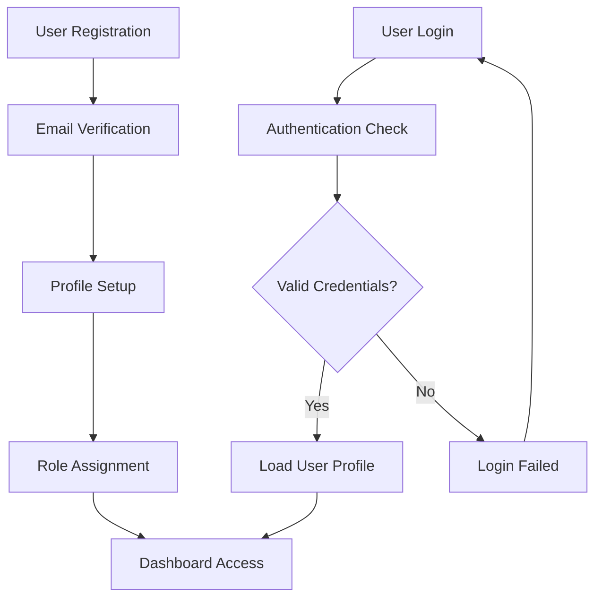
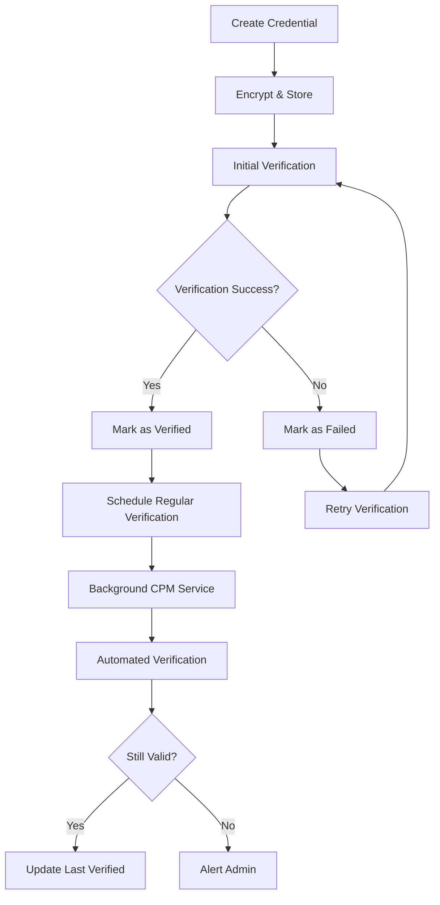
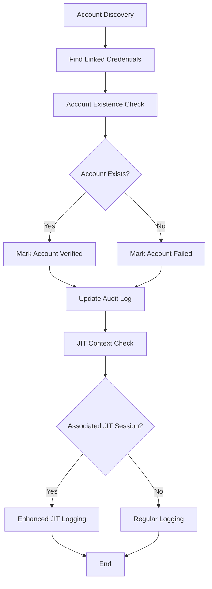
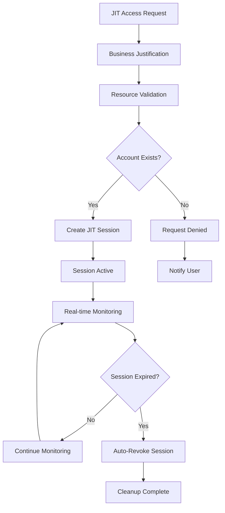
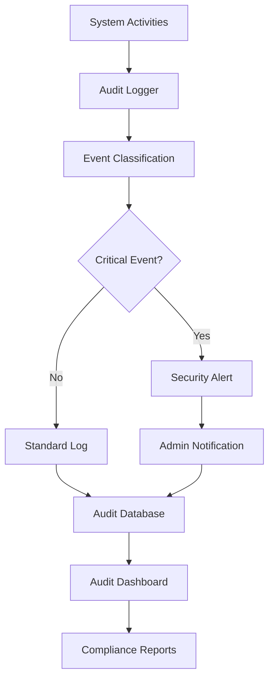

# CyberVault: End-to-End Application Flow

## 🏗️ Architecture Overview

CyberVault is a comprehensive privileged access management (PAM) platform that combines credential management, just-in-time (JIT) access control, and automated account validation. The system ensures secure, audited, and verified access to privileged accounts across various systems.

## 🎯 Core Components

### 1. **Credential Management System**
- Secure storage and encryption of privileged credentials
- Support for multiple credential types (SSH, Windows, Database, API tokens, Certificates)
- Automated credential verification and lifecycle management

### 2. **Just-In-Time (JIT) Access Control**
- Time-limited access sessions with business justification
- Automated session expiration and cleanup
- Real-time session monitoring and management

### 3. **Central Policy Manager (CPM)**
- Background credential verification service
- Support for multiple verification methods (SSH, WinRM, SMB, RDP)
- Automated account existence validation

### 4. **Account Validation Engine**
- Automated discovery and verification of privileged accounts
- Integration with JIT sessions for enhanced security
- Comprehensive audit logging and reporting

---

## 🔄 End-to-End User Flows

### Flow 1: User Registration & Authentication



**Steps:**
1. **Registration**: User creates account with email/password
2. **Verification**: Email confirmation required
3. **Profile Setup**: User provides additional details
4. **Role Assignment**: Admin assigns appropriate role (User/Admin)
5. **Dashboard Access**: User gains access to their dashboard view

### Flow 2: Credential Management Lifecycle



**Detailed Steps:**

#### 2.1 Credential Creation
1. **User Input**: User provides credential details (host, username, password/key)
2. **Validation**: System validates required fields and format
3. **Encryption**: Credential value encrypted using AES-256
4. **Storage**: Stored in PostgreSQL with RLS policies
5. **Initial Verification**: Immediate verification attempt using appropriate verifier

#### 2.2 Ongoing Verification (CPM Service)
1. **Scheduled Scan**: CPM service runs every 10 minutes
2. **Credential Discovery**: Finds credentials requiring verification
3. **Verifier Selection**: Routes to appropriate verifier (SSH/Windows/Database/etc.)
4. **Connection Test**: Attempts actual connection using credentials
5. **Status Update**: Updates credential status (verified/failed)
6. **Audit Logging**: Records verification attempt with details

### Flow 3: Account Validation System



**Detailed Steps:**

#### 3.1 Account Validation Job (Every 10 minutes)
1. **Account Discovery**: Find accounts with status 'pending' or due for re-validation
2. **Credential Linking**: 
   - Strategy 1: Exact match (hostname + username)
   - Strategy 2: Hostname match (prefer admin accounts)
   - Strategy 3: Owner fallback (any credential by same user)
3. **Verification Execution**:
   - **Linux/SSH**: Execute `id username`, `getent passwd username`
   - **Windows**: Execute `net user username`, `Get-LocalUser username`
4. **Status Update**: Mark account as verified/failed based on results
5. **Audit Trail**: Log verification attempt with full context

#### 3.2 JIT-Specific Account Validation (Every 5 minutes)
1. **Active Session Discovery**: Find all active JIT sessions
2. **Resource Mapping**: Map JIT resources to privileged accounts
3. **Account Verification**: Verify accounts associated with active sessions
4. **Failure Handling**: Critical failures may trigger security alerts
5. **Enhanced Logging**: Include JIT session context in audit logs

### Flow 4: Just-In-Time (JIT) Access Workflow



**Detailed Steps:**

#### 4.1 JIT Request Creation
1. **Resource Selection**: User specifies target system/resource
2. **Justification**: Business reason required (mandatory field)
3. **Duration**: Access duration specified (default/max limits apply)
4. **Pre-validation**: System checks if target accounts exist
5. **Session Creation**: If valid, creates time-limited session

#### 4.2 Active Session Management
1. **Real-time Monitoring**: Background job monitors session status
2. **Account Re-validation**: Periodic checks that accounts remain accessible
3. **Expiration Handling**: Automatic session revocation at expiry
4. **Manual Revocation**: Admin/user can revoke sessions early
5. **Audit Logging**: All session activities logged

#### 4.3 Session Cleanup (Hourly)
1. **Expired Session Detection**: Find sessions past expiration time
2. **Status Update**: Mark sessions as inactive
3. **Resource Cleanup**: Remove any temporary access grants
4. **Notification**: Alert users of expired sessions

### Flow 5: Security Monitoring & Audit



**Audit Event Types:**
- **credential_verification**: Regular credential validation
- **account_verification**: Account existence validation  
- **jit_account_verification**: JIT-specific account validation
- **jit_critical_verification_failure**: Critical JIT failures
- **jit_session_created**: New JIT session
- **jit_session_revoked**: Session termination
- **user_login**: Authentication events
- **credential_created**: New credential addition

---

## 🔧 Technical Implementation Details

### Database Schema
```sql
-- Core Tables
credentials (id, user_id, type, name, host, username, encrypted_value)
privileged_accounts (id, owner_id, system_type, hostname_ip, username)
jit_sessions (id, user_id, resource, system, business_justification, expires_at)
audit_logs (id, user_id, action, resource, metadata, timestamp)

-- Verification Tracking
account_verification_status, last_verified_at, verification_error
credential_status, last_verification_attempt, verified_at
```

### Background Services
1. **CPM Service**: Continuous credential verification
2. **Account Validation Job**: Account existence verification
3. **JIT Cleanup Job**: Session expiration management
4. **JIT Account Verification**: Enhanced validation for active sessions

### Security Features
- **Encryption**: AES-256 for credential values
- **Access Control**: Row-level security (RLS) policies
- **Audit Trail**: Comprehensive logging of all activities
- **Rate Limiting**: API protection against abuse
- **CORS**: Secure cross-origin request handling

### API Architecture
```
/api/v1/credentials/*     - Credential management
/api/v1/accounts/*        - Account management
/api/v1/jit/*            - JIT session control
/api/v1/audit/*          - Audit log access
/api/v1/cpm/*            - CPM service status
```

---

## 🎯 User Experience Flows

### Admin Dashboard Flow
1. **Login** → **Admin Dashboard**
2. **System Overview**: Credential health, JIT activity, recent alerts
3. **Credential Management**: Add/edit/verify credentials
4. **Account Validation**: Monitor account verification status
5. **JIT Session Management**: View/manage all active sessions
6. **Audit & Compliance**: Security logs and reports

### End User Flow
1. **Login** → **User Dashboard**
2. **My Credentials**: View personal credential status
3. **Request JIT Access**: Create time-limited access sessions
4. **Active Sessions**: Monitor current JIT sessions
5. **Account Status**: View verification status of accounts

### Security Team Flow
1. **Security Dashboard**: Critical alerts and failures
2. **Investigation Tools**: Detailed audit logs with JIT context
3. **Incident Response**: Manual validation triggers, session revocation
4. **Compliance Reporting**: Automated security reports

---

## 🚀 Key Benefits

### Security Benefits
- **Continuous Validation**: Automated verification ensures credentials work
- **Account Existence Verification**: Confirms privileged accounts exist
- **JIT Integration**: Enhanced security for time-limited access
- **Comprehensive Auditing**: Full trail of all access activities

### Operational Benefits
- **Automated Management**: Reduces manual credential verification
- **Real-time Monitoring**: Immediate alerts for credential failures
- **Centralized Control**: Single platform for all privileged access
- **Compliance Ready**: Built-in audit trails and reporting

### User Experience Benefits
- **Self-Service**: Users can request JIT access independently
- **Transparency**: Clear visibility into access status
- **Guided Workflows**: Intuitive interfaces for complex operations
- **Mobile Friendly**: Responsive design for on-the-go access

---

## 🔮 Future Enhancements

### Planned Features
- **Multi-factor Authentication**: Enhanced security for JIT sessions
- **Advanced Analytics**: ML-based anomaly detection
- **Integration APIs**: Connect with external PAM solutions
- **Mobile App**: Dedicated mobile application
- **Advanced Workflows**: Approval workflows for JIT requests

### Scalability Considerations
- **Microservices**: Split monolith into focused services
- **Container Orchestration**: Kubernetes deployment
- **Message Queues**: Async processing for heavy operations
- **Caching Layers**: Redis for performance optimization

This comprehensive flow ensures that CyberVault provides enterprise-grade privileged access management with robust security, compliance, and user experience.